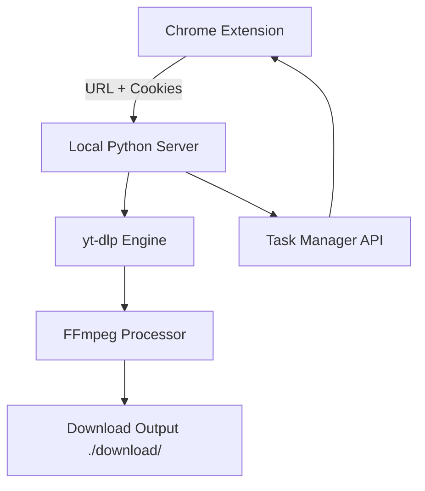
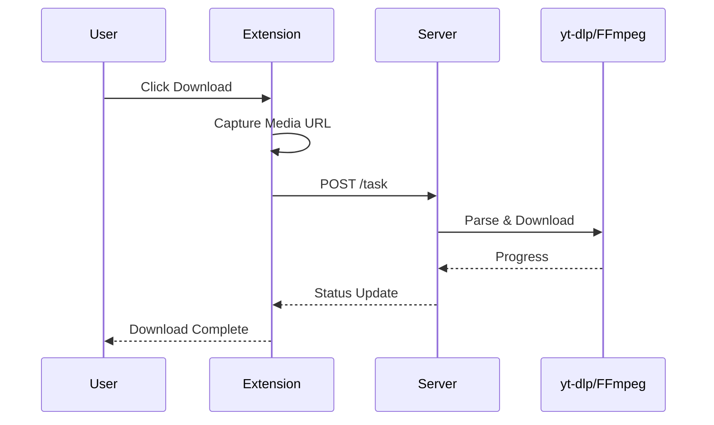

# Universal Video Downloader  
*A Cross-Platform Video & Audio Downloader Powered by Chrome Extension + Local Server*

<p align="left">
  
  
  
  
  
</p>

---

# 📑 Table of Contents
- [✨ Features](#-features)
- [📦 Dependencies](#-dependencies)
- [🧩 Project Structure](#-project-structure)
- [🛠 Installation Guide](#-installation-guide)
- [🚀 Usage Guide](#-usage-guide)
- [🏗 Architecture](#-architecture)
- [🔁 Download Flow](#-download-flow)
- [⚠ Important Notice](#-important-notice)
- [📄 License](#-license)

---

# ✨ Features

- 🧩 **Chrome Extension Media Sniffer**  
  Automatically captures video/audio streams from webpages.

- 🎬 **Multi-Platform Download Engine**  
  Works with YouTube, X/Twitter, Bilibili, Netease Cloud Music and more.

- 🔐 **Cookie Syncing**  
  Supports sites requiring login.

- ⬇️ **High-Quality Video/Audio Download**  
  Uses `yt-dlp` + `ffmpeg` for best format handling.

- 📁 **Task Management**  
  Multiple downloads with progress tracking.

- ⚙️ **Extensible Design**  
  Easy to integrate new platforms.

---

# 📦 Dependencies

- conda (Anaconda / Miniconda)
- Node.js 18+
- Python 3.9+
- FFmpeg
- yt-dlp

---

# 🧩 Project Structure

```
universal-video-downloader/
├── chrome-extension/
├── server/
│   ├── server-muavcookie.py
│   ├── downloader/
│   ├── cookies/
│   ├── tasks/
│   └── downloads/
└── README.md
```

---

# 🛠 Installation Guide

## 1. Python Env

```bash
conda create -n uvd python=3.9
conda activate uvd
pip install -r requirements.txt
```

## 2. Chrome Extension

- Open Chrome → chrome://extensions  
- Enable Developer Mode  
- Load unpacked → select `chrome-extension/`

## 3. Start Server

```bash
python server-muavcookie.py
```

---

# 🚀 Usage Guide

1. Open a webpage with media.
2. Click extension icon.
3. Refresh Cookie.
4. Choose Download Audio or Video.
5. Confirm and download.

Saved to:

```
./download/
```

---

# 🏗 Architecture



---

# 🔁 Download Flow



---

# ⚠ Important Notice

- For personal learning only.
- Commercial use prohibited.
- Developer not responsible for account bans or legal issues.
- Limited paid support for non-technical users.

---

# 📄 License

MIT License © 2025
